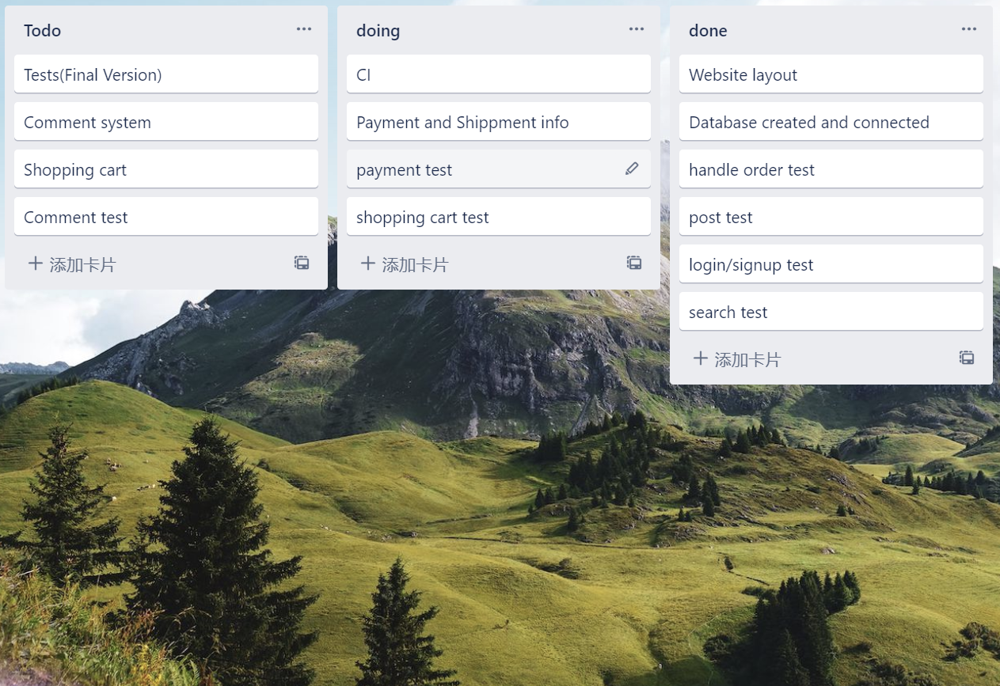

## progress summary
We have developed some of the unit test on our functional requirments, which includes log in, log out, create account, product system, and search/ filter system. The log in, log out, create account test, we will require the user to enter the valid username, and email to return true in order to process the account. Once the account has been created, the user information will store in the database (Functional reqirement 1). The user are able to add comment on the website for a specific product they purchased, however , they need to log in first. Therefore, our code will need user to enter their username and password, where we will retrieve the database in case they matched. after user logged in, they can click on the product and enter the comment. The comment type can be both photo and text, but there are word number limitation and one photo limitation (Functional reqirement 4). The problem occur in this stage is the photo transaction. The last one we finished is the search and filter system. User are able to search the product by the initial or the key words and filter by the categories(Functional reqirement 11). Clerk are able to maintain the product, whcih they can in stock and out stock of the products, be able to maintain the product status (Functional reqirement 8). we still have some fuctional reqirements left, whcih includes the payment system, shopping cart system, and order modify and status. 

## Comments on the process
Everything is in the progress, everyone has working their best on their part of the repsonsibilities. currently, nothing will need to change. 

