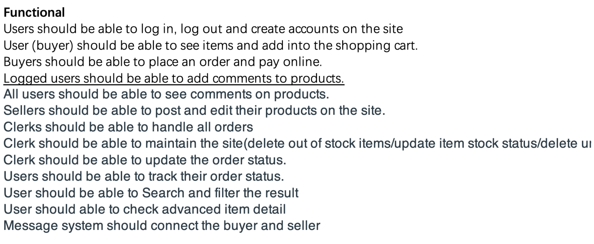

# Project-Ph17 Team Final Report 
## **General Development**
### ***What did your team build? Is it feature complete and running?***

Our team has decide to build a online market place that is operate by website form. The feature include, shopping cart function, handle order function, payment system, and log in/ log out/ sign up functions. These functions are working well on our final result. 

### ***How many of your initial requirements that your team set out to deliver did you actually deliver (a checklist/table would help to summarize)?  Were you able to deliver everything or are there things missing?  Did your initial requirements sufficiently capture the details needed for the project?***

 
There are intially 13 function requirement as shown above, and 10 functions are delivered at the end. The above functions are planed to added into out website, however, we decide to remove the comment function and message center as they are quite complicate for us. Though, we missed two function, but we still think that our website can achieve the basic online market function suffciently. 

### ***What is the architecture of the system?  What are the key components?   What design patterns did you use in the implementation?  This needs to be sufficiently detailed so that the reader will have an understanding of what was built and what components were used/created.  You will need to reflect on what you planned to build vs what you built.***
1. The first phase is the planining phase, whcih we are plaining what function is needed to be include for a online marketplace. Which we concluded some key component include,  **User interface**, **Database**, **Payment function**, **comment function** and lastly **search engine**. 
2. The second phase is the rapid testing and revision phase. We create testing code and starting coding on the each function, rapdily testing until the code is good to go and passing every test. Which some problem occur, which is the difficulty on the comment function, therefore, we decide to delete this function in out website. 
3. The third phase is user interface design. We using php to create website. Overall, beside the comment function, every functions should be ready on the website. We think out presentation on the website is pretty well.
4. As mentioned, we used to have comment function and message center. We deduction on these two function is due to the reason of lack of skill and time. 
### ***What degree and level of re-use was the team able to achieve and why?***
The level of reuse is medium, we have reuse the user interface layout from our previous assignment. 
### ***How many tasks are left in the backlog?***
There are nothing backlog left for our team. 

## **CI/CD**
### ***What testing strategies did you implement?  Comment on their degree of automation and the tools used.    Would you (as a team) deal with testing differently in the future?  Make sure to ensure that your testing report is updated to reflect what's actually been done.***
we use code-driven testing, which we follow the cycle, when the test fails, we rewrite test. As the test passed, we refactor and clean the code. I think this type of testing method works pretty well, didn't think about to use another one in the future. or will changed, depends on the type of project. 
### ***How did your branching workflow work for the team?  Were you successful in properly reviewing the code before merging as a team?***
The workflow is pretty well. And, Yes, of course, we always review the updated code or work before merge. 
### ***How would your project be deployed?  Is it docker ready and tested?  Provide a brief description of the level of dockerization you have implemented and what would be required to deploy.***
We didn't use docker as our resources,we use another substitue which is XAMPP. We consider this resources will work better with our project, as this sever is mainly used for web application testing on a local host web sever. All the functions have passed the test on the XAMPP. 

## **Reflections**
### ***How did your project management work for the team?  What was the hardest thing and what would you do the same/differently the next time you plan to complete a project like this?*** 
The project management for our team is okay. As there are some time conflict occur between out team. However, because when we working on the project we always get together in person which avoid the merge conflict. Next time we will still prefer to work in person, as we can discuss the problem imediatly and increase the effeciency. We will avoid lack of time management and planning, which we will try to design a clear and concise plan before start working. 
### ***Do you feel that your initial requirements were sufficiently detailed for this project?  Which requirements did you miss or overlook?***
I think initially we do have sufficiently detailed requirements, might missing a little, but those requirements might be out of our skill level. However, we overlook the comment function requirement, therefore, we decide to delete it from our system.
### ***What did you miss in your initial planning for the project (beyond just the requirements)?***
I thinl onw thing we have missed is the quantity of products in stock, which we have added in the final result.
### ***What process did you use (ie Scrum, Kanabn..), how was it managed, and what was observed?*** 
We use Kanban to manage the working process. We have create a Kanban and added all the members inside. There are three sections which is to-do, doing, and done. We assign the work to each person and keep tracking each week. 
### ***As a team, did you encounter issues with different team members developing with different IDEs?  In the future, would the team change anything in regard to the uniformity of development environments?***
No, we do not encounter such issues. we think rapdily communicate and work ethic is key to avoid such events. 
### ***If you were to estimate the efforts required for this project again, what would you consider?  (Really I am asking the team to reflect on the difference between what you thought it would take to complete the project vs what it actually took to deliver it).***
Our team think this project is pretty compelicted and time-taking. It require many knowledge that we never learned before and the process and revision taked a lot of time. This project require knowledge not only from class content also the ability to code. This is a great experience for us to experience the software engerneering process and will be a valued experience for our future assignments. 
### ***What did your team do that you feel is unique or something that the team is especially proud of (was there a big learning moment that the team had in terms of gaining knowledge of a new concept/process that was implemented).***
Tis project is especially an unique experience for us, as it does not increase our ability on the coding also the ability on the project planning and processing. This experience can be fused into our future project or even in future job. 